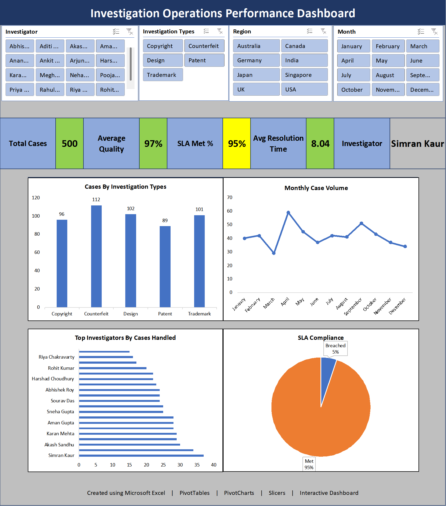

# 📊 Interactive Investigation Operations Performance Dashboard

## Dashboard Preview

---

## 📌 Project Overview

This project is an interactive Microsoft Excel dashboard developed to analyze investigation operations performance using a realistic dataset of **500 investigation records**.

The dashboard enables users to monitor investigation trends, investigator performance, SLA compliance, quality scores, and operational KPIs through interactive slicers and dynamic visualizations.

---

## 🎯 Business Objective

Operations managers need quick insights into investigation performance to monitor productivity, maintain SLA compliance, and identify performance trends.

This dashboard provides an interactive reporting solution to support operational decision-making.

---

## 🛠 Tools Used

- Microsoft Excel
- PivotTables
- PivotCharts
- Slicers
- Conditional Formatting

---

## 📈 Dashboard Features

- Interactive KPI Cards
- Investigation Type Analysis
- Monthly Case Volume Trend
- Top Investigator Performance
- SLA Compliance Analysis
- Dynamic Filtering using Slicers

---

## 📊 Key Performance Indicators

- Total Cases
- Average Quality Score
- SLA Compliance (%)
- Average Resolution Time
- Top Investigator

---

## 📂 Dataset

A synthetic dataset of **500 investigation records** was created based on real-world investigation workflows.

The dataset includes:

- Investigator
- Investigation Type
- Seller Region
- Case Source
- Resolution Time
- Quality Score
- SLA Status
- Month
- Cases Handled

---

## 💼 Skills Demonstrated

- Advanced Excel
- Data Cleaning
- Data Analysis
- Dashboard Development
- KPI Reporting
- Data Visualization
- PivotTables
- PivotCharts
- Business Reporting

---

## 🚀 Future Enhancements

- Build the same dashboard in Power BI.
- Connect to SQL database.
- Automate data refresh using Power Query.

---

## 👤 Author

**Smita Chatterjee**

Aspiring Data Analyst | Advanced Excel | Power BI | SQL
